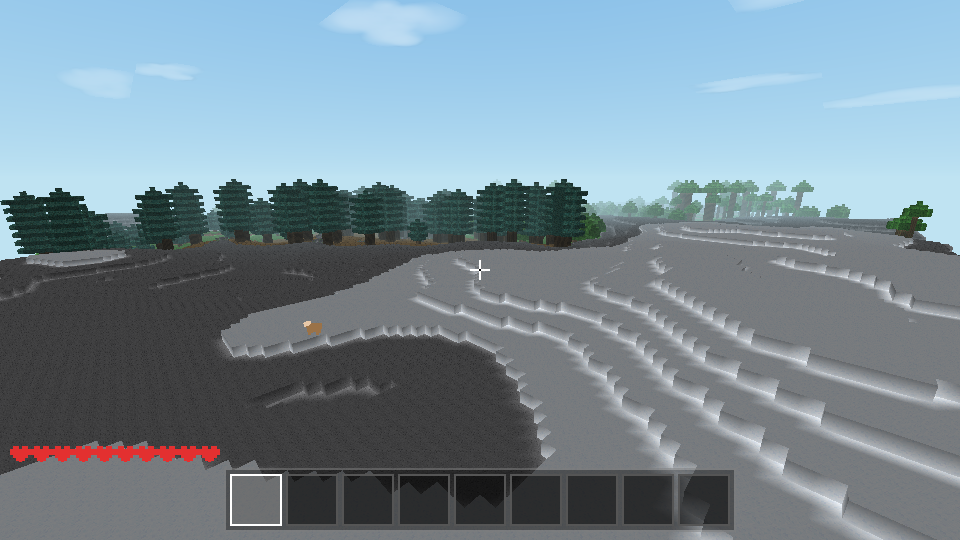

# Starbound Voxel

**Language:** [中文](README.md) · [English](README.en.md)

A No Man's Sky-inspired 3D voxel exploration game built with plain HTML5, JavaScript, and Three.js.
One galaxy seed deterministically creates six distinct planets and an orbital station, with seeded portals, a starship interface, a warp engine, interstellar travel, per-world persistence, and responsive desktop/mobile controls. Zero runtime dependencies and zero build step — **double-click `index.html` and play in the browser**.

## Interstellar exploration

- Six seeded planet classes: lush, arid, frozen, toxic, volcanic, and oceanic.
- Three or four deterministic portals per planet, including a route to the station.
- A pixel starship near the landing site; press `E` or `H` nearby to open the star map.
- Distance-based warp energy, discovery tracking, an orbital station, and automatic station refuelling.
- Save v5 keeps edits and positions separate per world while inventory and ship progress travel with you.
- The top-right Star Map control keeps the same loop available on phones and tablets.

<table>
  <tr>
    <td align="center" width="33%">
      
      <br /><sub>Plains: grassy hills, oak trees, and sheep</sub>
    </td>
    <td align="center" width="33%">
      
      <br /><sub>Forest: dense oak woods</sub>
    </td>
    <td align="center" width="33%">
      
      <br /><sub>Desert: dunes, cacti, and sandstone layers</sub>
    </td>
  </tr>
  <tr>
    <td align="center">
      
      <br /><sub>Snowy plains: snow-covered ground and spruce</sub>
    </td>
    <td align="center">
      
      <br /><sub>Taiga: stretches of spruce forest</sub>
    </td>
    <td align="center">
      
      <br /><sub>Mega taiga: podzol and giant spruce</sub>
    </td>
  </tr>
  <tr>
    <td align="center">
      
      <br /><sub>Jungle: towering 2×2 giant jungle trees</sub>
    </td>
    <td align="center">
      
      <br /><sub>Mountains: rocky peaks and exposed cliffs</sub>
    </td>
    <td align="center">
      
      <br /><sub>Overview: natural biome transitions from above</sub>
    </td>
  </tr>
</table>

## Running

```bash
# Option 1: open index.html directly (recommended)
open index.html

# Option 2: local server (optional)
python3 -m http.server 8080
# then visit http://localhost:8080
```

> Requires a WebGL-capable browser (Chrome / Edge / Firefox / Safari).
> Saves use localStorage; if the browser restricts storage on `file://`, use option 2.

## Controls

| Key | Action |
|---|---|
| Mouse | Look around (click the canvas to lock the pointer) |
| WASD / Arrow keys | Move |
| Space | Jump / swim up / fly up |
| Shift | Sprint / fly down |
| Left click | Place a block (current hotbar slot) |
| Hold right click | Mine a block (progress + crack animation; click a mob to attack) |
| Middle click | Pick the targeted block (prefers an existing hotbar slot) |
| 1–9 / Scroll wheel | Select hotbar slot |
| E | Open/close inventory (2×2 crafting) · look at a crafting table and press E for 3×3 · look at a bed and press E to sleep / set spawn |
| F | Toggle flight |
| G | Cycle weather (clear → rain → thunderstorm) |
| F3 | Show/hide debug overlay |
| M | Open/close crafting handbook (recipe list + one-click craft; hold to craft continuously) |
| P | Pause menu (manual save / settings / key bindings / save and return to main menu) |
| Esc | Release the mouse |

## Mobile touch controls

Touch devices enable a floating left-side movement stick, right-side look/tap/hold gestures, and on-screen jump, fly, pause, and inventory buttons automatically. Starting, continuing, resuming, respawning, or choosing a featured world attempts immersive fullscreen; if the browser rejects it, the game continues in a layout fitted to the currently visible browser viewport. Use **Enter fullscreen** in the pause menu to retry.

Inventory, crafting table, furnace, chest, crafting handbook, and settings panels all have a pinned close button. On low-height landscape screens the panels use horizontal space first and keep any remaining overflow scrollable inside the panel, so no keyboard-only exit is required.

## Settings

Open **Settings** from the main menu or pause menu to adjust input, audio, view distance, render resolution, frame-rate cap, and effect-density options. Changes apply immediately and are stored in this browser (localStorage).

## Features

- **Infinite procedural planets**: planet terrain streams indefinitely in X/Z, including negative coordinates and beyond the legacy 0..255 area; distant chunks unload to bound memory while player edits and block metadata persist. The original 256×256 core is regenerated exactly for old-save compatibility, while orbital stations intentionally remain finite platforms in vacuum. World height remains 64 blocks
- **Eight biomes**: dual temperature/humidity climate noise plus elevation — plains (sparse oaks), forest (dense woods), desert (dunes / cacti / sandstone layers), snowy plains (snow + spruce), taiga (spruce forest), mega taiga (podzol, 2×2 giant spruce, mossy cobble boulders), jungle (towering 2×2 giant jungle trees, up to ~30 blocks), mountains (rocky peaks); snow covers the ground above the snow line
- **Lighting**: dual-channel BFS — sky light (fades with the day/night cycle; caves are dark) and block light (torches stay on); incremental updates when blocks are added or removed; torches need a supporting block and light a radius of about 14
- **Mining and placing**: DDA voxel raycast targeting; hold to mine with a crack progress animation; blocks have different hardness; pickaxes speed up stone and unlock ore tiers (coal → wooden pickaxe, iron → stone pickaxe); bedrock is unbreakable
- **Conservative item stacks**: matching items stack to ×64; when inventory space runs out, cursor remainders, crafting-grid materials, mob loot, and container blocks become world drops at the correct position with count and durability preserved instead of disappearing
- **Tools and weapons**: wooden/stone/iron tools retain exact durability through Shift moves, drag-and-drop, middle-click swaps, chests, cursor saves, reloads, and interplanetary travel; tools are rejected from crafting/furnace slots that cannot represent durability
- **Physics**: gravity, jumping, AABB collision, swimming, creative flight; fall damage (from more than 3 blocks); drown after 10 seconds underwater (HUD air bubbles)
- **Day/night cycle**: 30 minutes per cycle; gradient sky dome (daytime blue → dusk purple zenith / deep-orange horizon → deep-blue night), red-orange sunset, stars, moonlight; the surface keeps moonlight brightness at night
- **Weather**: automatic clear → rain → thunderstorm cycle (G to switch manually); drifting clouds, raindrops, darker rainy lighting + closer fog, branched lightning + double white flash + delayed thunder, lightning damage to the player, a rainbow after rain on a sunny day; rain and thunder are synthesized with WebAudio
- **Mobs**: passive mobs spawn by biome — sheep (plains/taiga, bleat, drop wool), pigs and chickens (forest/jungle/plains), rabbits (desert/snowy plains, fastest); zombies hunt at night (groan; burn in sunlight except in caves); attacks use line-of-sight and height checks so they cannot hit through walls; swords deal more damage
- **Crafting**: inventory 2×2 grid (oak log → ×4 planks, 2×2 planks → crafting table, 2 planks → ×4 sticks), crafting table 3×3 grid (pickaxes/swords/bed), crafting handbook (M to browse all 11 recipes); bed (3 wool + 3 planks) is crafted at a table and is half-height so you can stand on it
- **Beds**: look at a bed and press E to set your spawn; at night, press E to sleep and skip to dawn (fade-to-black); zombies burn in daylight
- **Combat**: 10 hearts, red hit flash, slow regen; respawn at the bed spawn (if set) or the world spawn
- **Protected saves**: saves preserve the galaxy, per-world edits/metadata, inventory durability, cursor item/durability, both temporary crafting grids, bed, warp energy, and discoveries—even when refreshing inside a chest or furnace. New/featured worlds require a verified backup first, and **Restore previous save** can swap back and forth. v3/v4 saves migrate automatically to v5
- **Procedural art / audio**: all 16×16 pixel textures are generated in code (including tool icons and crack animation); open-source samples (Kenney / OpenGameArt) are lazy-loaded as SFX, day-BGM, and night-BGM chunks that retain `file://` offline support, with WebAudio synthesis as fallback; material-specific footsteps (grass/sand/snow/stone/wood/leaves…), mine/place/land, water splash, underwater muffling + water loop, swim bubbles, sheep bleats, zombie groans (distance attenuation + stereo panning), cross-fading day/night BGM, rain and thunder
- **First-person held item**: the current block (cube) or tool (sprite) is shown in the bottom-right; swing on mine/attack/place, slight bob while walking
- **World details**: sky dome / sun / moon / stars / clouds follow the camera (no sky offset at the map edge); sand and gravel fall without support; water floods into opened adjacent cells; mobs float in water
- **Hit feedback**: zombie hits apply knockback and a brief lift; a red arrow at the screen edge shows damage direction; the death screen shows the cause (zombie / lightning / drowning / fall)

## Project structure

```
index.html            Entry (all UI + script load order)
css/style.css         Pixel-style UI
vendor/three.min.js   Three.js r128 (local, works offline)
js/
├── config.js         All tunable parameters
├── blocks.js         Block definitions + procedural texture atlas
├── crafting.js       Recipe data + 3×3 matching (pure logic)
├── world/
│   ├── noise.js      Seeded value noise + fBm (2D/3D, temperature/humidity climate channels)
│   ├── biomes.js     Biome registry and climate selection (pure logic, Node-testable)
│   ├── world.js      Finite legacy core / station world generation
│   ├── infinite.js   Infinite-X/Z planet facade, sparse chunk streaming and eviction
│   └── mesh.js       Chunk meshes: face culling + vertex AO
├── player/
│   ├── physics.js    AABB block collision
│   ├── controls.js   Pointer lock + keyboard
│   └── player.js     Movement / gravity / swimming / flight
├── interact/raycast.js   DDA voxel raycast
├── entities/mobs.js      Sheep / pig / chicken / rabbit / zombie AI (biome-based spawn)
├── systems/
│   ├── daynight.js   Day/night, gradient sky dome, stars
│   ├── weather.js    Weather: clear/rain/thunderstorm, raindrops, clouds, lightning, rainbow
│   ├── sound.js      Audio (samples first + WebAudio fallback, BGM, rain/thunder)
│   ├── particles.js  Break particles
│   └── save.js       localStorage saves
├── ui/hud.js         Hotbar / inventory / health / debug
├── assets.js         Small audio manifest, content hashes, and credits (generated)
├── assets-sfx.js     Lazy chunk containing 42 sampled sound effects (generated)
├── assets-music-day.js / assets-music-night.js  Independently loaded BGM chunks
└── main.js           State machine + main loop
assets_src/           Original and processed mp3 audio (see Audio credits)
tools/                process_audio.sh (ffmpeg) and build_audio.js (generates the manifest and three lazy chunks)
test/smoke.js         Node smoke tests (no browser required)
```

## Tests

```bash
node test/smoke.js          # Node smoke tests: noise, terrain, determinism, save restore (seconds)

# Full browser tests (requires puppeteer-core):
npm i puppeteer-core --no-audit --no-fund
node test/run_browser_tests.js     # Auto-detects Chrome/Edge/Chromium; you can also pass a path
```

| Test file | Coverage |
|---|---|
| `test/smoke.js` | Noise and terrain determinism, **negative chunk coordinates, continuity across the former 255/256 edge, order-independent chunk generation, bounded streaming memory, outer-chunk edit reloads, and cross-chunk torch light**, biome signature blocks, save round-trips, crafting, smelting, and lighting |
| `test/browser_test.html` | Full game stack: main loop, physics landing, DDA raycast, mine/place, mob spawn/death/wool drops, handbook one-click + hold-to-craft, inventory 2×2 start crafting (oak → planks → crafting table), stack-by-slot placing, drag-and-drop, crafting table 3×3 (bed), handbook, half-height bed mesh + physics, day/night, weather (rain intensity / raindrops / grey clouds / lightning flash / lightning damage / rainbow day-night conditions / G-key cycle), damage/death/respawn, save round-trip, mesh rebuild (no renderer; logic only), light init and torch lighting, new-world empty inventory, audio function smoke |
| `test/render_check.html` | Real WebGL render for 240 frames + pixel sampling (sky and terrain both visible) |
| `test/capture_screenshots.js` | README scene screenshots (day / dusk / rain / snow mountains) |
| `test/capture_biomes.js` | README 3×3 biome screenshots (8 biomes + overview, fixed seed) |

## Tunable parameters

`js/config.js`: finite-core/station size, infinite-planet render/data/eviction radii and per-frame generation budget, water level, snow line, day length, player movement and survival parameters, mobs, weather, fog, and more.

## Suggested first steps

1. Chop trees for oak logs → craft planks in the 2×2 inventory grid → craft sticks from 2 planks
2. Craft a crafting table from 4 planks, place it, look at it, and press E for the 3×3 grid
3. Craft a wooden pickaxe (3 planks + 2 sticks) → hold right-click to mine stone and coal
4. Craft torches (coal + stick, ×4) and place them to light caves
5. Kill sheep for wool; craft a bed (3 wool + 3 planks). Sleep at night to skip to dawn and set your spawn

## Known limitations

- No furnace/smelting (iron ore is used directly for iron tools); tools have no durability
- Lighting is per-block flat light (no smooth interpolation); torches cannot be placed on walls
- Single-player only; immersive fullscreen depends on browser support, with an adaptive in-browser fallback
- Planets stream indefinitely in X/Z but remain 64 blocks tall; the resident chunk set and fog distance are bounded, and an extremely fast player may briefly meet a protective loading frontier
- The legacy 256×256 core still takes roughly 1–2 seconds plus light initialization on first load; outer chunks generate incrementally during play

## Audio credits

Sound effects and background music come from these open-source sources (build scripts: `tools/process_audio.sh` + `tools/build_audio.js`):

| File | Source | License |
|---|---|---|
| Footsteps (grass/snow/stone/wood/wool), mine/place, land, UI | [Kenney "Impact Sounds"](https://kenney.nl/assets/impact-sounds) | CC0 1.0 |
| Dirt footsteps (pitch-shifted grass step) | Kenney "Impact Sounds" (processed) | CC0 1.0 |
| Gravel / leaf footsteps | ["Different steps..." by kdd @ OpenGameArt](https://opengameart.org/content/different-steps-on-wood-stone-leaves-gravel-and-mud) | CC0 1.0 |
| Sand / water footsteps, sheep bleats (including hurt), large splash | [Yo Frankie! assets @ OpenGameArt](https://opengameart.org/content/sheep-sound-bleats-yo-frankie) | CC-BY 3.0 (Blender Foundation) |
| Zombie groan | ["Zombie Sound" @ OpenGameArt](https://opengameart.org/content/zombie-sound) | CC0 1.0 |
| Day BGM | ["Calm Ambient 3 - Lifewave 2k" by The Cynic Project / Pixelsphere](https://opengameart.org/content/calm-ambient-3-lifewave-2k) | CC0 1.0 |
| Night BGM | ["Calm Piano 1 - Vaporware" by The Cynic Project / Pixelsphere](https://opengameart.org/content/cc0-calm-relaxing-music) | CC0 1.0 |

Swim bubbles, jump, player hurt, rain, thunder, and the underwater ambience are synthesized with WebAudio and have no external source.
All samples are trimmed, loudness-normalized, and converted to MP3. `js/assets.js` stays a small manifest; 42 SFX samples and the day/night tracks load on demand from three content-hashed script chunks that also work over `file://`. If loading or decoding fails, the game falls back to procedural synthesis.
