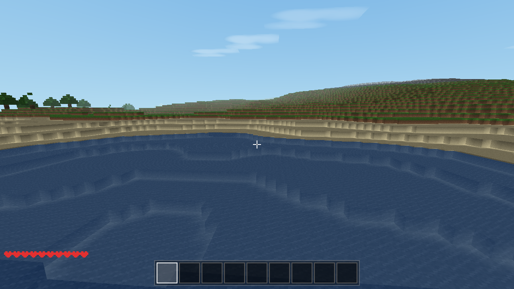
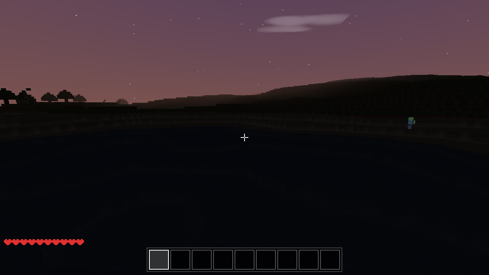
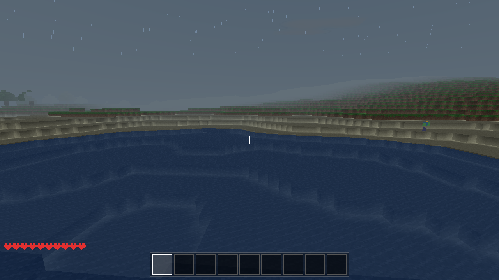
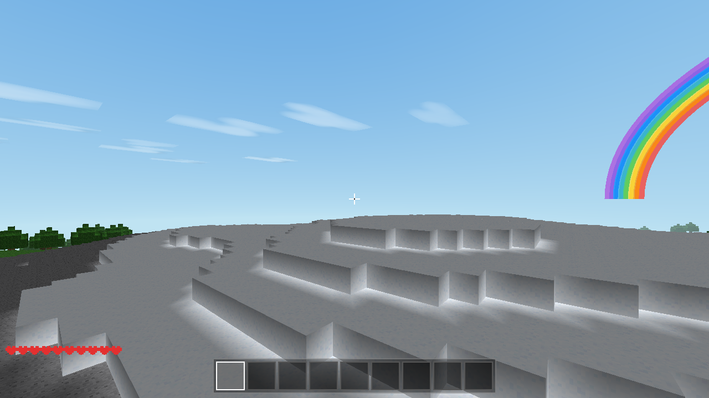

# 方块世界 VoxelCraft

一个用纯 HTML5 + JavaScript + Three.js 实现的 3D 体素像素游戏（类 Minecraft）。
零依赖、零构建 —— **双击 `index.html` 即可在浏览器中游玩**。

<table>
  <tr>
    <td align="center" width="50%">
      
      <br /><sub>白天地形：沙滩、丘陵与树木</sub>
    </td>
    <td align="center" width="50%">
      
      <br /><sub>黄昏星空：紫顶橙霞、星辰与夕阳</sub>
    </td>
  </tr>
  <tr>
    <td align="center" width="50%">
      
      <br /><sub>雨天云雾：流动云层、雨丝与近雾</sub>
    </td>
    <td align="center" width="50%">
      
      <br /><sub>雪顶高山：雪线之上的覆雪山峰</sub>
    </td>
  </tr>
</table>

## 运行

```bash
# 方式一：直接双击 index.html（推荐）
open index.html

# 方式二：本地服务器（可选）
python3 -m http.server 8080
# 然后访问 http://localhost:8080
```

> 需要支持 WebGL 的浏览器（Chrome / Edge / Firefox / Safari）。
> 存档使用 localStorage；若浏览器对 file:// 协议限制存储，请用方式二运行。

## 操作说明

| 按键 | 功能 |
|---|---|
| 鼠标 | 视角（点击画面锁定鼠标） |
| WASD / 方向键 | 移动 |
| 空格 | 跳跃 / 游泳上浮 / 飞行上升 |
| Shift | 疾跑 / 飞行下降 |
| 左键 | 放置方块（使用当前快捷栏格） |
| 右键长按 | 挖掘方块（进度+裂纹动画；点生物=攻击） |
| 中键 | 吸取所看方块（优先选中已有的格） |
| 1-9 / 滚轮 | 选择快捷栏 |
| E | 打开/关闭背包（含 2×2 合成）· 准星对准工作台按 E 打开 3×3 合成 · 对准床按 E 睡觉/设重生点 |
| F | 切换飞行模式 |
| G | 切换天气（晴 → 雨 → 雷雨循环） |
| F3 | 显示/隐藏调试信息 |
| M | 打开/关闭合成手册（配方一览 + 一键合成，长按连续合成） |
| P | 暂停菜单（含手动存档） |
| Esc | 释放鼠标 |

## 游戏内容

- **程序化世界**：256×256×64，噪声地形、湖泊海洋、沙滩、山脉、雪顶高山（雪线可调）、洞穴、树木、煤矿/铁矿
- **光照系统**：天光（随昼夜渐变，洞穴漆黑）+ 块光（火把恒亮）双通道 BFS 传播，方块增删增量重算；火把需依托放置，照亮半径约 14 格
- **挖掘与放置**：DDA 体素射线选取，长按挖掘带进度裂纹动画；不同方块有不同硬度，镐类工具大幅加速石头系并解锁矿石等级（煤→木镐、铁→石镐）；基岩不可破坏
- **物品堆叠**：同类物品 ×64 自动堆叠显示数量，拖拽/点击支持整叠搬移与同物合并
- **工具与武器**：木板→木棍→木镐/木剑，石/铁升级；剑提升攻击力；煤矿掉落煤炭，煤+木棍合成火把
- **物理**：重力、跳跃、AABB 碰撞、游泳、飞行（创造式）；摔落伤害（高于 3 格）、水下憋气 10 秒后溺水掉血（HUD 氧气气泡）
- **昼夜循环**：30 分钟一轮，渐变天空穹顶（白天蓝→黄昏紫顶/深橙地平线→夜晚深蓝）、红橙夕阳、星空、月光；夜晚地表保留月光亮度
- **天气系统**：晴→雨→雷雨自动循环（G 键可手动切换），流动云层、雨滴、雨天压暗+近雾、闪电枝+双闪白屏+延迟雷鸣、雷击玩家伤害、雨停后白天出彩虹；雨声/雷鸣为 WebAudio 合成
- **生物**：白天游走的小羊（会咩叫，击杀掉落羊毛），夜晚追击的僵尸（会呻吟，日出自燃——洞里不烧），攻击有视线与高度判定不再隔墙伤人；剑类武器伤害更高
- **合成系统**：背包 2×2 合成格（橡木→×4 木板、2×2 木板→工作台、2 木板→×4 木棍）、工作台 3×3 合成格（镐/剑/床）、合成手册（M 键查看全部 11 条配方）；床（3 羊毛+3 木板）在工作台合成，半高可站上
- **床的功能**：对准床按 E 设置重生点；夜晚按 E 睡觉直接跳到清晨（渐黑过渡），僵尸白天自燃
- **战斗**：10 颗心血量、受击红屏、缓慢回血、死亡后在床重生点（若设置）或出生点复活
- **存档**：自动存档（30 秒）+ 手动存档 + 睡觉时存档，保存种子与修改增量、背包堆叠数量、床重生点；刷新页面可继续，旧版存档自动兼容
- **程序化美术/音效**：16×16 像素纹理全部由代码生成（含工具图标与裂纹动画），音效由 WebAudio 合成，无任何外部资源；分材质脚步声（草/沙/雪/石/木/叶…）、入水溅水、水下闷音+水声、游泳气泡、跳跃/落地声、羊叫、僵尸呻吟（均随距离衰减）

## 项目结构

```
index.html            入口（全部 UI + 脚本加载顺序）
css/style.css         像素风 UI
vendor/three.min.js   Three.js r128（本地，离线可用）
js/
├── config.js         全部可调参数
├── blocks.js         方块定义 + 程序化纹理图集
├── crafting.js       合成配方数据 + 3x3 匹配（纯逻辑）
├── world/
│   ├── noise.js      种子化值噪声 + fBm（2D/3D）
│   ├── world.js      世界数据、地形生成、增量存档
│   └── mesh.js       区块网格：面剔除 + 顶点 AO
├── player/
│   ├── physics.js    AABB 方块碰撞
│   ├── controls.js   指针锁定 + 键盘
│   └── player.js     移动/重力/游泳/飞行
├── interact/raycast.js   DDA 体素射线
├── entities/mobs.js      羊 / 僵尸 AI
├── systems/
│   ├── daynight.js   昼夜、渐变天空穹顶、星辰
│   ├── weather.js    天气：晴/雨/雷雨、雨滴、云、闪电雷鸣、彩虹
│   ├── sound.js      WebAudio 合成音效
│   ├── particles.js  破碎粒子
│   └── save.js       localStorage 存档
├── ui/hud.js         快捷栏/背包/血量/调试
└── main.js           状态机 + 主循环
test/smoke.js         Node 冒烟测试（无需浏览器）
```

## 测试

```bash
node test/smoke.js          # Node 冒烟测试：噪声、地形生成、确定性、存档还原（秒级）

# 浏览器端全量测试（需 puppeteer-core）：
npm i puppeteer-core --no-audit --no-fund
node test/run_browser_tests.js     # 自动查找 Chrome/Edge/Chromium，也可显式传入路径
```

| 测试文件 | 覆盖内容 |
|---|---|
| `test/smoke.js` | 噪声确定性、世界生成（水/树/洞/矿）、雪线高山、出生点、增量存档往返、合成配方匹配/消耗（含工具/火把配方）、一键合成背包计数、掉落与工具等级、光照引擎（天光/火把传播/衰减/移除熄灭） |
| `test/browser_test.html` | 完整游戏栈：主循环、物理落地、DDA 射线、挖放、生物生成/死亡/掉羊毛、手册一键合成+长按连续合成、背包 2×2 开局合成（橡木→木板→工作台）、堆叠逐格放置、拖拽交互、工作台 3×3 合成（床）、合成手册、半高床网格+物理、昼夜、天气（雨强度/雨滴/云层变灰/闪电闪屏/雷击掉血/彩虹昼夜条件/G 键切换）、受伤/死亡/重生、存档往返、网格重建（渲染置空，纯逻辑验证）、光照初始化与火把点亮、新世界清空背包回归、音效函数冒烟 |
| `test/render_check.html` | 真实 WebGL 渲染 240 帧 + 像素采样（验证画面中天空与地形均可见） |

## 可调参数

`js/config.js`：世界尺寸、水位线、雪线（SNOW_LEVEL）、昼夜时长、玩家速度/跳跃高度/摔落伤害阈值（FALL_SAFE）/憋气时长（AIR_MAX）、生物数量与行为、天气（`WEATHER`：晴/雨/雷暴时长、雨滴数、云数量、闪电间隔、雷击概率与伤害、彩虹时长、雨天雾距）、雾效距离等。

## 新手流程建议

1. 砍树得橡木 → 背包 2×2 合成木板 → 2 木板合成木棍
2. 4 木板合成工作台，放置后对准按 E 打开 3×3
3. 3 木板+2 木棍合成木镐 → 长按右键开采石头与煤矿
4. 煤炭+木棍合成火把（×4），插在洞穴里照亮
5. 击杀羊收集羊毛，3 羊毛+3 木板合成床：夜晚睡觉跳过黑夜并记录重生点

## 已知限制

- 无熔炉/烧炼（铁矿直接用于合成铁镐/铁剑），工具无耐久
- 光照为逐格平面光照（无平滑插值）；火把不支持贴墙姿态
- 单进程世界（无多人联机）、无移动端触控
- 生成整个 256×256 世界约 1-2 秒 + 光照初始化约 1 秒（进度条可见），区块网格渐进构建
